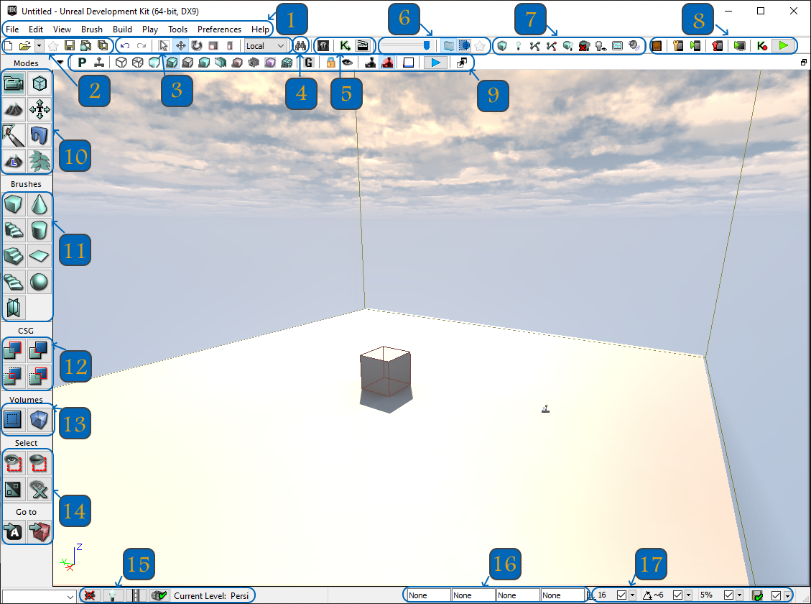
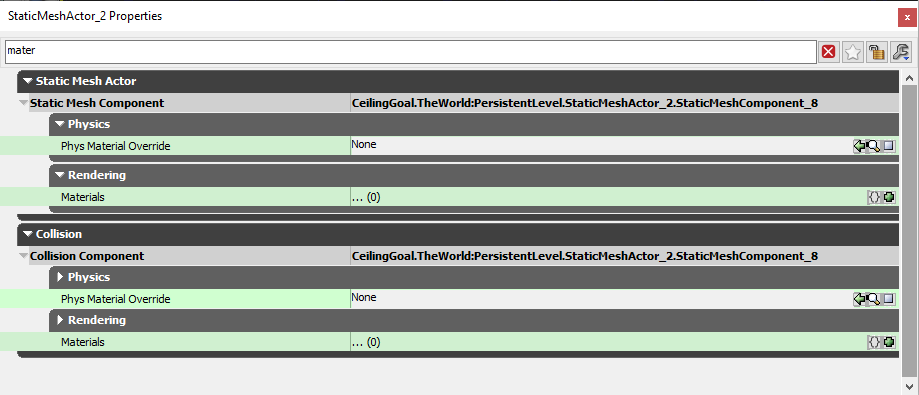

# UDK Basics

## Editor window

*The main course*

### 1 - Dropdown menu's

* File - Contains what you would expect. **However, CTRL+S IS NOT SAVE. To save, you have to manually click Save. Save All will save any external packages you have also modified. Save Current Level is typically the best choice.**
* Edit - Everything in this menu may also be found in the various toolbars.
* View - **`Browser Windows > Content Browser` to open the Content Browser if you close it.** The options through the middle are reasonably self-explanatory. But, I would like to highlight the `New Viewport` and `Viewport Configuration` options at the bottom. These allow you to have multiple views open, which is a workflow that some people are more comfortable with. **To eliminate part of a split viewport, resize it to 0.**
* Brush - These options are all found in section 11 of the GUI. They build geometry in the viewer.
* Build - This is for finalizing the map. Before you test it in-game, it is always a good idea to `Build Paths`. If you want to see your map in its full beauty, you should `Build Lighting`. Alternatively, you can just `Build All` whenever you feel like it. Building can take a while, but will catch any errors like invalid spawn points or invalid geometry.
* Play - Sadly, this menu is dead to us.
* Tools - Theoretically these are useful, but probably only in very specific circumstances.
* Preferences - Tons of minor quality of life things you can try out. Quality of life is capped at a low level because we’re in UDK, so don’t expect any miracles.
* Help - We’re on our own. Sorry.

### 2 - File Operations

New, load, save, etc. No surprises here.

### 3 - Editor Window Options	

Undo, redo, and then the settings for the manipulator widget. These are to move/translate, rotate, scale uniformly, and scale per axis. The dropdown menu for World/Local changes the coordinate system.

### 4 - Editor Window Actor Search

This can be nice to select specific items which may be buried or misplaced.

### 5 - Useful Popup Windows

These bring up the [Content Browser](), [Kismet](), and [Matinee]() windows. Each of these will be explained in painful amounts of (relevant) detail in their own sections.

### 6 - Editor Visibility Options

The slider adjusts “Cull Distance,” or the cutoff distance for displaying things. You probably don’t ever need to touch it. The button immediately to the right of it allows for selecting objects which have a transparent material.

## Properties Window

When you have an actor selected and do either `right click > Properties` (the top option), `View > Actor Properties`, or press `F4`, the Properties popup window will appear. This is a huge pile of settings, so the key is to know what you are after and disregard the rest. **The search bar is your best friend.** Keep in mind that this list will be different for each actor type, so it can be good to familiarize yourself with the contents so that you know what to search for. The sections which deal with actually making the map provide some recommended shorthand versions of parameter names for easy searching.

*Almost as much fun as filing your taxes!*

As you mouse over the various buttons on the right edge, the tooltips will fill you in on what they do. However, it can still be a little unclear from their descriptions.

## General Advice

Try going into an empty project and just pressing literally every button and every key combo you can think of. You’ll learn tons of things about this program. This is also my best piece of advice for learning Blender. **Don’t be afraid of buttons in software.**
