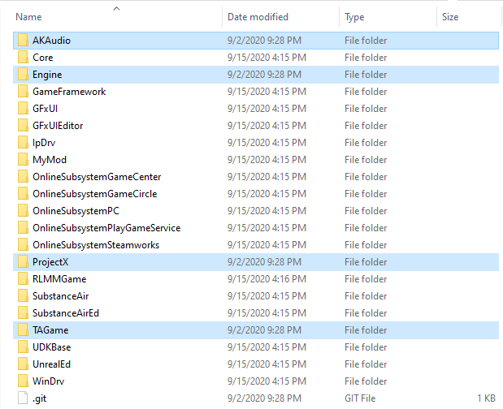

# Dummy Classes

Thanks to the work of dedicated modders, there is a repository of wonderful Dummy Classes available to you.

These are UDK-ready classes with the same names and properties as the customized classes that were created by Psyonix developers for Rocket League. They allow us to drop in objects which have advanced functionality, such as goals and boost pads.

The download may be found under [Downloads.](../resources/downloads.html#setup)
If you feel like using git, you can run git clone within the UDK folder. Downloading the .zip file is totally fine too.



Extract the .zip, and paste the four folders alongside all of the others in
`{UDK Folder}\Development\Src`

The Development folder already has a folder named `Engine`. When you paste these into `{UDK Folder}\Development\Src`, Windows should automatically combine the contents of the folders. Accept any warnings if it complains.

## Edit Files <Badge text="important" type="tip"/>

Using Notepad or Notepad++ or Sublime or whatever you like, **open the file `DefaultEngine.ini` within `{UDK Folder}\UDKGame\Config\`**

Insert these lines
```ini
+EditPackages=AKAudio
+EditPackages=ProjectX
+EditPackages=TAGame
```
under these lines
```ini
[UnrealEd.EditorEngine]
+EditPackages={ProjectName}Game
```
So it looks like this:
```ini{3-5}
[UnrealEd.EditorEngine]
+EditPackages={ProjectName}Game
+EditPackages=AKAudio
+EditPackages=ProjectX
+EditPackages=TAGame
```

This tells UDK to recognize that these folders contain assets that you intend to use, and allows you to place them in the editor.

**Inside `{UDK Folder}\Development\Src\Engine\Classes\` open `StaticMeshActor.uc`, `PrimitiveComponent.uc`, and `Actor.uc`.**

**In `StaticMeshActor.uc`** go to these lines
```unrealscript
Begin Object Class=StaticMeshComponent Name=StaticMeshComponent0
    bAllowApproximateOcclusion=TRUE
    bForceDirectLightMap=TRUE
    bUsePrecomputedShadows=TRUE
End Object
```
And replace it with these lines
```unrealscript{5-7}
Begin Object Class=StaticMeshComponent Name=StaticMeshComponent0
    bAllowApproximateOcclusion=TRUE
    bForceDirectLightMap=TRUE
    bUsePrecomputedShadows=TRUE
    BlockRigidBody=false
    bDisableAllRigidBody=true
    bAcceptsDynamicDecals=false
End Object
```
This is to set the defaults that we want on every solid object in the game.

**In `PrimitiveComponent.uc`** go to these lines:
```unrealscript
enum ERBCollisionChannel
{
    RBCC_Default,
    RBCC_Nothing, // Special channel that nothing should request collision with.
    RBCC_Pawn,
    RBCC_Vehicle,
    RBCC_Water,
    RBCC_GameplayPhysics,
    RBCC_EffectPhysics,
    RBCC_Untitled1,
    RBCC_Untitled2,
    RBCC_Untitled3,
    RBCC_Untitled4,
    RBCC_Cloth,
    RBCC_FluidDrain,
    RBCC_SoftBody,
    RBCC_FracturedMeshPart,
    RBCC_BlockingVolume,
    RBCC_DeadPawn,
    RBCC_Clothing,
    RBCC_ClothingCollision
};
```
And replace it with these lines:
```unrealscript{10-12}
enum ERBCollisionChannel
{
    RBCC_Default,
    RBCC_Nothing, // Special channel that nothing should request collision with.
    RBCC_Pawn,
    RBCC_Vehicle,
    RBCC_Water,
    RBCC_GameplayPhysics,
    RBCC_EffectPhysics,
    RBCC_Ball,
    RBCC_VehicleBlocker,
    RBCC_BallBlocker,
    RBCC_Untitled1,
    RBCC_Untitled2,
    RBCC_Untitled3,
    RBCC_Untitled4,
    RBCC_Cloth,
    RBCC_FluidDrain,
    RBCC_SoftBody,
    RBCC_FracturedMeshPart,
    RBCC_BlockingVolume,
    RBCC_DeadPawn,
    RBCC_Clothing,
    RBCC_ClothingCollision
};
```
This allows us to give objects different collision channels for different behaviors. VehicleBlocker objects allow the ball through, but not the player. BallBlocker is the reverse. And Ball is… like the ball.

**Lastly, in `Actor.uc`** go to this line:
```unrealscript
var const bool bNoDelete; // Cannot be deleted during play.
```
And replace it with this line:
```unrealscript
var() const bool bNoDelete; // Cannot be deleted during play.
```
This is (I believe) to get the FXActors we use for boost pads to behave as expected.

**Lastly, you will need to recompile UDK scripts so it recognizes these changes.**

::: warning Note
If you ever change these files in the future, you will need to recompile again.
:::

In `{UDK Folder}\Binaries\`, run `UnrealFrontend.exe`. 


**Click Script and run Full Recompile.** Close it after it finishes, and now you’re allowed to start.
...almost

## Park_P

Thanks to the hard work of friendly modders, there is an extremely useful UDK Package (.UPK) which contains a number of assets ripped from the game. They allow you to build your map with pieces and materials that are already in the game. However, the important thing is that they have the exact same name as the in-game assets. More on this aspect of things later.

You can find the download [Here.](../resources/downloads.html#park-p-dummy-assets)

**Place this into `{UDK Folder}\UDKGame\Content\`** alongside the various other files. UDK will recognize it here and make its contents available to you.

[A later section](../guide/udk/15_dummy_assets.md) of this guide will show you how to use any resource from any map, but this is more than enough to get started with.
