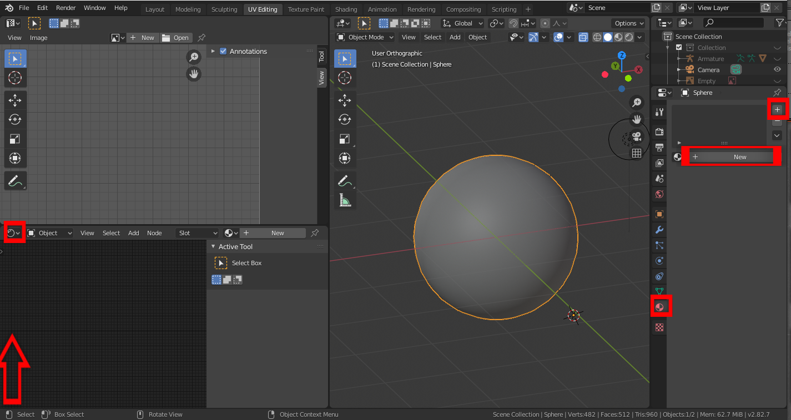
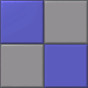
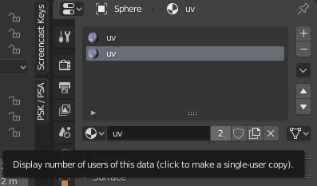
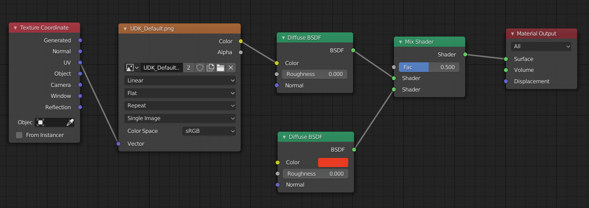
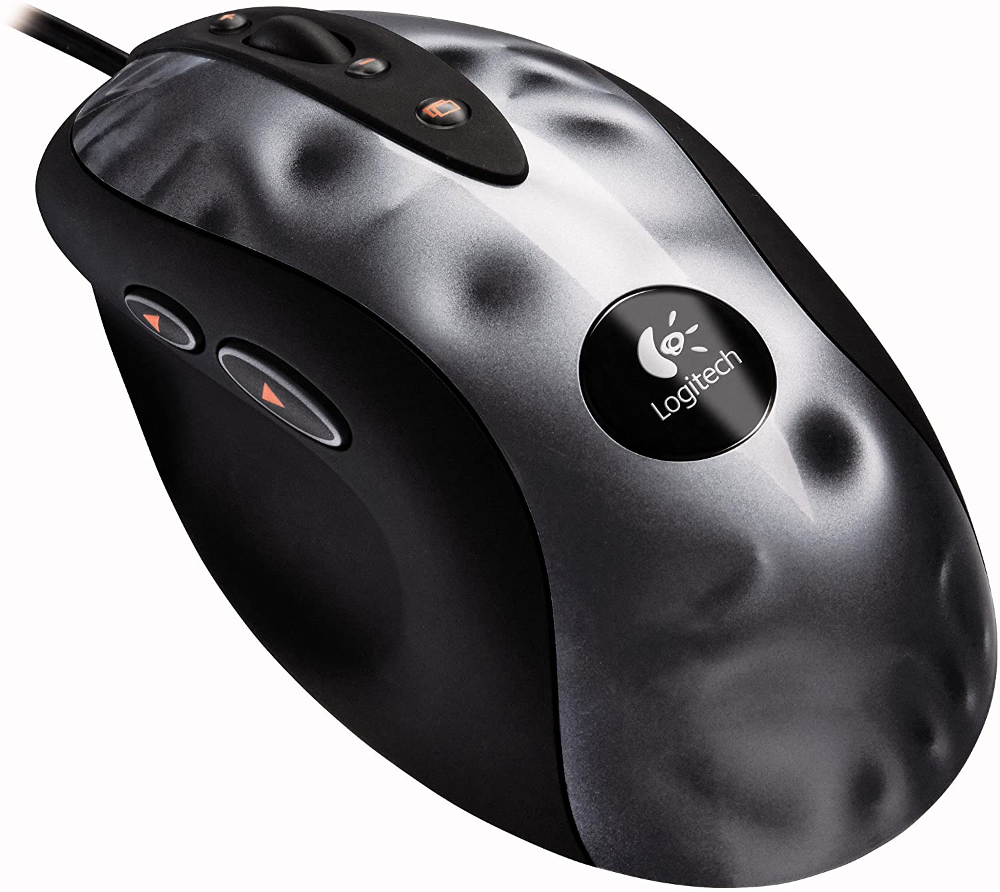
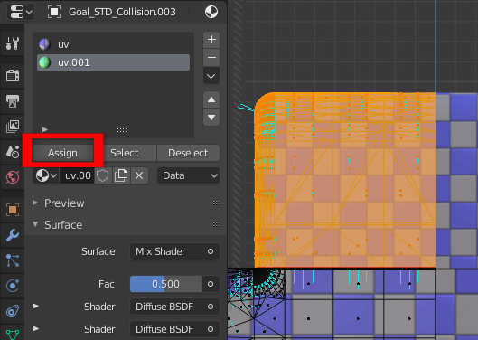
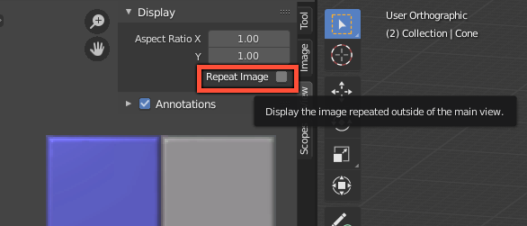

# Blender Basics

## UV Maps and Materials

UV Maps are a bit of a confusing topic, because they blur the boundaries between 3D and 2D. To speak mathematically, they are a projection map from the 3D space to the 2D space. They correlate X and Y in the 2D texture space to a 2D space along the surface of a 3D mesh (surface normal space). They belong to the mesh itself, and will be data inside the .FBX files for UDK.

 = (0.5 + atan2(dx,dz)/2π, 0.5-asin2(dy)/π) . This will be on the test.")

The reason we care about UV mapping is because it is how we tell UDK (or any worthwhile render engine) to display textures on a 3D surface. Without them, there is no texture and we’re stuck in a sad world of solid tones.

## A Brief Refresher
Recall these from the [Blender Key Terms](02_intro.html#key-terms) section :

* `Mesh` - A 3D object made of vertices, edges, and faces. Meshes have Materials and UV Maps.
* `Material` - All aspects of an object’s surface properties. Materials have Textures.
* `Texture` - A 2D image
* `UV Map` - A mapping of a 2D image onto a 3D surface
* `Texel` - A pixel of a UV-mapped texture on a 3D surface

## Materials Setup

When making assets for UDK, I have found that one very useful approach is to use the default UDK grid texture, but make several slightly colorized versions (for reasons that will be explained). This helps you keep UV scaling consistent (or inconsistent) across all of your assets, and pairs nicely with any CSG work you’ve done (despite my best attempts to dissuade you). UV scaling will be discussed further in the section on [Texels](08_resolution).

To get set up with these materials, **switch to the UV Editing layout. Left click and drag up from the lower left corner to spawn a new subwindow. Switch this one to a Shader Editor. Then, select your mesh, go to the Materials tab, and add a new Material Slot with the plus button. Lastly, click New to create a new Material to go in this slot. Name it whatever makes sense.**

So, to clarify, an Object in Blender (like this sphere) **has** a Mesh (the actual vertices, edges, and faces), **has** Material Slots (places to reference Materials), and **has** numerous other properties. It is the sum total of all of these things. This is analogous to how StaticMeshActors in UDK have StaticMeshes, along with properties like a location. But, Materials and Textures themselves are standalone chunks of data, just as they are inside the UDK Content Browser.

Now, let’s set up the Material. Inside the Shader Editor Window, there should be a couple of placeholder nodes from when you created the new material. **Delete the Principled BSDF node, but keep the Material Output node.**

**With `Shift A`, search for and add a “Texture Coordinate” node, an “Image Texture” node, and a “Diffuse BSDF” node. Connect them as shown. Save this lovely checkerboard texture to somewhere on your computer and Open it in the Image Texture node.**

Next, we will create 3 near-copies of this which are colorized.

Back in the Materials tab of the Properties subwindow, **add a new material slot and select the same material. Click on the 2 (or 3 or whatever it shows) to create a detached/single-user copy of this material. Rename it appropriately, or don’t. I also recommend clicking the shield button (Fake User) so that Blender preserves this material even when nobody is using it.**

 

Inside the Shader Editor, add a Mix Shader node. Drag this onto the line between the Diffuse BSDF and the Material Output to automatically insert it in-line. Add a second Diffuse BSDF and connect it to the other Shader port of the Mix Shader node. Set this one to a static color of your choice by clicking the color box.

Now, to actually see these materials on meshes within Blender, **you will need to set the Viewport Shading mode to either Material Preview or Rendered (the rightmost two options).** When messing around with UV maps, you will want to leave this on. Otherwise, feel free to switch back to solid shading for mesh work to reduce the visual madness.

## Multi-Material Objects
The whole point of setting up the Blender project with multiple materials is so that we can create meshes which have different materials on different parts.

Take, for example, the splendid mouse that I used to place the cursor at the start of this line before typing this sentence. If I were to recreate this in Blender, I would need to create 3 materials:

* The beautiful flowy silver part
* The awesome black rubbery parts
* The wonderful buttons and logo

Sadly, we’re stuck with very basic material creation capabilities within UDK, whereas you can recreate almost anything imaginable in Blender. **All that matters to UDK is how many material slots the FBX has.** So, within Blender, your task is to assign different parts of the mesh to different materials so that, in UDK, you may assign multiple materials to the same StaticMesh and have them appear on the correct parts.

This is why I recommend creating a set of slightly colorized materials, so that you can more easily see which parts of the mesh have which material. For CeilingGoal, the net portion of the goal needs to be transparent so that the creepy hand is visible, but the rest of the wall needs to be opaque.

In Edit Mode, **select the faces which will receive this material. Navigate to the Materials tab, select the second (or third, etc) material, and click Assign.** If you have the 3D View subwindow in Material Preview shading mode, you will see this portion of the mesh change color.

We will revisit this when we assign materials to these slots in UDK in the UDK Advanced sections (or you may skip ahead… I can’t stop you). But first, a few more key concepts.

## Texture Space Terminology
- `Tiling` - Repeating a texture by placing copies like… tiles
- `Reflecting` - Reaching the edge of a texture sets you back inside by how much you overshot (not really used in Blender)
- `Clamping` - Nothing can move past the edge (not used in texture spaces in Blender, but used elsewhere)

Generally, all UV map coordinates are tiled, meaning that when you have a UV map extend past the edges of the shown texture, the empty space essentially contains copies that are tiled out to infinity in all directions. To actually show this in Blender, **press `N` to bring up the Settings Toolbar within the UV/Image Editor. Under View, enable Repeat Image.** I personally prefer to work with it disabled to reduce visual clutter.