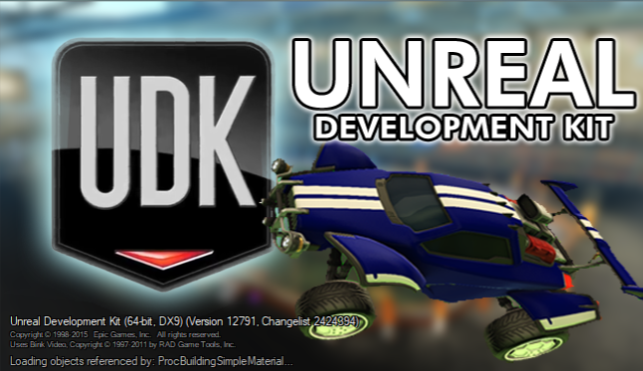

# Miscellaneous

If you have used the [quick setup script](), there's a chance that you already have these changes which should help you a bit more, otherwise you can always use the [custom UDK script]() if you dont want to do it manually or want to reinstall UDK. Feel free to adjust them to your own preferences (changing these settings doesn't require a full recompile). 

:::tip Language
This page is written for the international (American english - `INT`) version of UDK. You can change your language in `Preferences` > `Editor language` or replace `INT` with the three letters of your language
:::

## Splash screen

To replace the UDK splash screen with your own image, save the image as a `.bpm` file (preferably with a size of 650*375), rename the image to `EdSplash` and replace it with the standard splash screen in \
`{UDK Folder}/UDKGame/Splash/PC/`



## Welcome screen

Except for choosing if you want to see the welcome screen when starting UDK, you can change more:
- In `{UDK Folder}\Engine\EditorResources\WPF\Localized\UnrealEd.INT.xaml` you can change the text and the description of the welcome messages (lines 250-271)
- In `{UDK Folder}\Engine\EditorResources\WPF\Controls\WelcomeScreen.xaml` you can replace the images and the background of the welcome screen with your own images. Replace the current source (in line 13-20) with the path of the image, they can be located in anywhere on your computer
- In `{UDK Folder}\Engine\Localization\INT\UnrealEd.int` you can change the text above the title by replacing `WelcomeScreen_Title` (line 71)

:::warning Changing URLs
You can only change the URLs of these messages if you know how to reverse-engineer UDK and find where the values for the links are located (please let me know if that is the case)
:::

## Map templates

You can replace the UDK templates with (your own) custom maps templates. They should have (almost) the latest framework updates. How to save your own map as a template:

1. Open the map you want to have as a template and press `File` > `Save as...`. You can rename it if you want another name, in these steps it will be referenced as `MapTemplateName`. **Change to extension to `.umap`!**. Save it in `{UDK Folder}/Engine/Content/Maps/Templates` (here you will see all the other templates)
2. Go back to the content browser and search for the MapTemplateIndex package. When clicking on it you should see all the existing templates
3. Right click on the package and select `New TemplateMapMetadata`
4. **Change the name to the same name as the map you saved in step 1 (without the extension)**, so the name would be `MapTemplateName`.
5. Right click the MapTemplateIndex package and press save
6. Take a photo / screenshot of the map and **crop it to 256x256, 512x512 or 1024x1024** (any size with a power of 2 will work)
7. Save the image as a .tga 24 bit texture
8. In the Content Browser Click import and use all defaults properties to import the .tga texture
9. Double click on the TemplateMapMetadata package for your template map, select your image from the content browser and add the image as a thumbnail
10. Save the package again and exit UDK
11. Open `{UDK Folder}/Engine/Localization/INT/EditorMapTemplates.int` and add the following line (replacing `MapTemplateName` with your own template name):
```int
MapTemplateName=This is what you see in UDK
```
12. Save the file, close it and open UDK. You should be able to see your own template!

<!-- more than 6 templates? -->

## UDK Tips

In `{UDK Folder}\Engine\Localization\INT\EditorTips.int` you can set your own UDK / map making tips by replacing the text after `Tip_xxxxx=`. Place `\n` for a single line break. 
```int
Tip_00001=Did you know you can replace the current tips by your own?\n\nGet started at https://rocketleaguemapmaking.com/guide/misc/08_custom_udk.html and customize UDK!
```
<!-- more than 50 tips? -->

## Documentation

In the [content browser](../../essential/08_content_browser.html#content-browser) is a tab for the documentation which you can fill with your own usefull links by editing `{UDK Folder}\Engine\EditorResources\UDKOffline.html`

* [example page]()

## UDK custom keys

#### Kismet 

In `{UDK Folder}\UDKGame\Config\UDKEditor.ini` you can edit [the standard hotkeys](https://docs.unrealengine.com/udk/Three/KismetUserGuide.html#Hotkeys) or add your own hotkeys. **Make sure your hotkey doesn't match [an existing kismet view hotkey](../kismet/01_kismet.html#the-hottest-hotkeys)!**

* [hotkeys example]()

#### Matinee

In the Matinee window you can set your own hotkeys for the matinee editor by going to `edit` > `Configure keyboard shortcuts`, but you can also configure them in the same file as the kismet hotkeys (lines 190-227)

## Menu

## More

You can dive into the source code of UDK and discover maybe some more things (if you did find something dont forget to share it in the discord server!), but there is not much more to discover here. Let's hope Psyonix moves to UE5 when the time is ready...