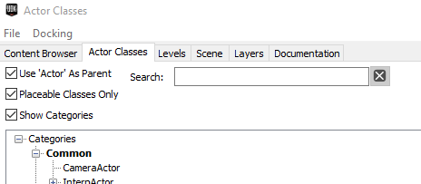
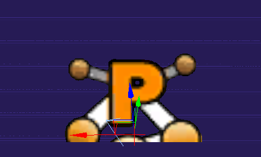
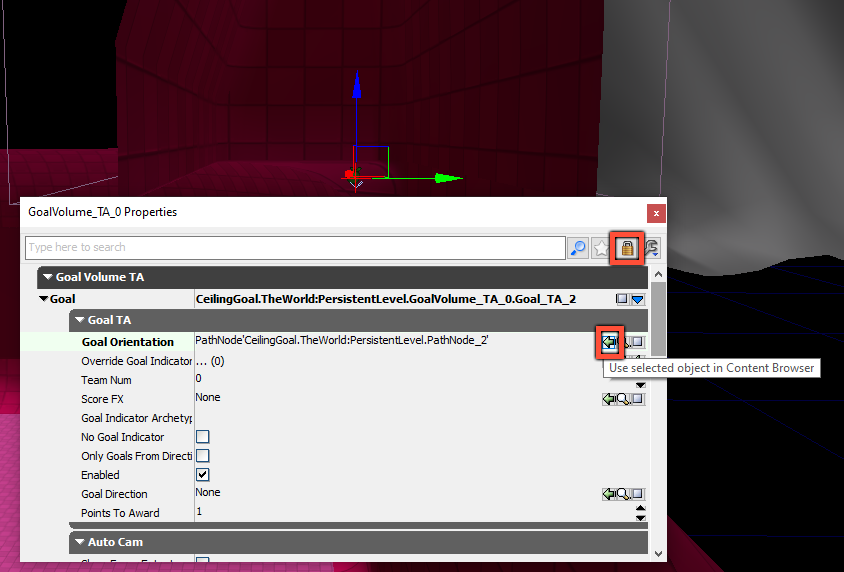
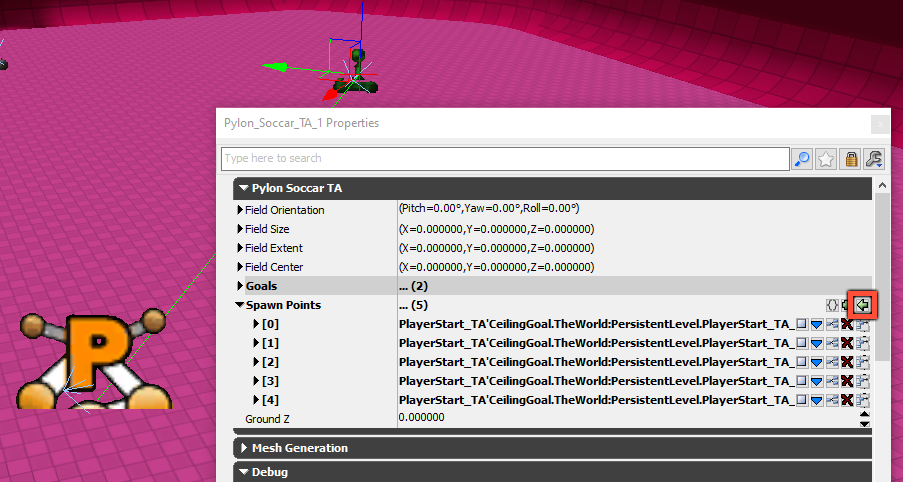

# UDK Basics

## Game Items

So, you can make a pretty cool looking box. That’s more than half the battle. Sadly, Rocket League requires a little more detail for the map to be truly playable. This section will explain how to add interesting elements to the map, such as player spawns, goals, teleporters, and boost.

This section will reference many custom classes that are available from the Dummy Classes section above. **If you don’t see them in UDK, you may need to repeat those steps.**

These custom actor classes may be found in the Actor Classes tab of the Content Browser window. **To add them, simply click the item and drag it into the 3D Editor window. If that doesn’t work, left click it in the Actor Classes window, then right click in the 3D Editor and select “Add {ClassName} Here”.**

## Pylon_Soccar_TA

The Pylon is an object which Rocket League needs to detect that this is a playable map. Without it, you will not be able to spawn a game ball, and a number of other features such as automatic team coloration on the map will likely not happen.

Place the `Pylon_Soccar_TA` at the center of the playing field (ideally near (0,0,0)). Inside its properties, **change Draw Scale to 5. UDK will clamp it to 3.202685, which is fine. Position it so that it appears roughly as shown in the picture above, where the bottom is partially in the ground.** This should correspond to a Z height of roughly 50.

If the Pylon is too high or too low, **the map will be unplayable because this is where the ball spawns.** We will revisit the Pylon once Player Spawns and Goals have been added.

## PlayerStart_TA

Player spawn points will fight you at every turn, but don’t forget that you are the boss. Similar to the `Pylon_Soccar_TA`, it’s easiest to add them from the Actors tab of the Content Browser.

Place a `PlayerStart_TA` into the map. Bring up the Properties window and set these values:

|Search for|Change the line(s)|To this value|
|------|------|------|
|“team”|Team Index|1|
|“dest”|Destination Only|True|
|“draw”|Draw Scale|5|
|“loc”|X|0|
|“loc”|Y|4608*|
|“loc”|Z|83|

The Team Index value is not required to be 1 (Blue team), but it helps avoid confusion because these will be the Blue team’s spawn points.

Destination Only is also not required, but setting it will avoid a warning when you Build Paths.

With Draw Scale set to 5, the bottoms of these spawn points should just barely be inside the ground. This is a useful hack for when you have curved surfaces or surfaces not at 0 height.

Because the game will be played along the Y axis (using the default setup of Pylon_Soccar_TA), **the important thing is that the Y value is positive.** The goal that Blue team receives points for scoring on is at a negative Y location (i.e. across the field from these spawn points).

If you want to create a set of standard Soccar spawns, **duplicate (Ctrl+D) this PlayerStart_TA four times. Set the following locations and rotations:**

|Number|X|Y|Z|Roll|Pitch|Yaw|
|------|------|------|------|------|------|------|
|1|0|4608|83|0|0|-90|
|2|256|3840|83|0|0|-90|
|3|-256|3840|83|0|0|-90|
|4|2040|2560|83|0|0|225|
|5|-2040|2560|83|0|0|-45|

If you have been following along, you might have had the idea to get clever and use the Transform > Mirror X Axis tool. This works for getting them to the correct location, **but Mirroring across an axis also sets the scale in that axis to negative.** What this means for a spawn point is that you might spawn backward or upside down. If you do choose to use Mirror, reset all of the Scale options to 1 and then fix the rotation. In the end, you won’t save any time by using it.

:::tip Demo spawn points
If you add more spawnpoints than the 5 points above, they will be used for spawnpoints **only** when someone is demoed
:::

## GoalVolume_TA

Surprisingly, one key detail of most multiplayer maps is a goal for each team to score on. Goals are very easy to add once the rest of the map is in place. 
:::warning
Finish this whole Goal Volume section before testing, otherwise you’ll probably crash Rocket League.
:::

**Set the brush to the goal shape you want. A standard Soccar goal is roughly 1800x880x650 (X,Y,Z) Unreal units. Position it where you want the goal to be, then add a GoalVolume_TA from the Volumes list.**

There are 3 reasons you might not see the Goal Volume right after you add it:

* The CSG brush outline completely hides it (to find it, move the brush)
* Volumes are hidden (to find it, press `O`)
* It’s behind the geometry, whereas the brush will always be visible (to find it, fly your camera around)

Also keep in mind that the ball must be 100% inside this volume for a goal to happen, **so it’s necessary to make the Goal Volume bigger than the surrounding geometry.** You can always resize it using the scale tool (specifically Non-Uniform Scaling mode).

Rocket League expects each goal to have an orientation in 3D space as well. This is mainly to calculate the velocity of the ball when it’s scored, and to orient/situate goal explosions like the Twin Dragons or Overgrowth. The goals will work just fine without them, but you get additional control by doing this step. **Right click somewhere in the goal geometry. Go to Add Actor > Add Path Node. Center this PathNode on the mouth of the goal and fix its rotation so that it points out of the goal.** Keep the Draw Scale of this PathNode at 1… unless you want hilarious and enormous goal explosions.

You may have also noticed that you cannot set the location of this volume from its properties, meaning that you have to rely on the move tool in the 3D Editor Window. Here are two handy tricks to move it:

* Right click on the Move tool on the top bar and type in numbers. “Relative” means that you move it by that amount.
* Adjust the grid snap size in the very bottom right to a smaller number (or disable it if you’re brave). This way you can get the placement just right.

**Bring up the Properties window of the Goal Volume and Lock the window to keep it visible. Select the Path Node and click Use selected object for the Goal Orientation.**

**Select the Goal Volume and Path Node and create a copy with Ctrl+C, Ctrl+V. Move them to the other side of the map. You may need to manually reassign the Goal Orientation Path Node of the copied goal.**

Additionally, you may need to type “GoalIndicator_TA” in the Goal Indicator Archetype field, if your game crashes when scoring a goal. Checking the box for No Goal Indicator should also prevent crashing

Lastly, one of the goals needs to be for Orange Team, and one needs to be for Blue Team. **When Rocket League sees a Pylon_Soccar_TA with default settings, it sets up the game to be played along the Y axis (e.g. goals at +5000Y and -5000Y). Also keep in mind that a “team’s goal” is the one that it is trying to score on (i.e. getting the ball there gives that team a point).**

|Team|Team Num|Y Location of Team’s Goal|
|------|------|------|
|Orange|0|Positive|
|Blue|1|Negative|

**Set up the goals like this, then Build Paths (or Build All). Save, load the map, and make sure that you can score in both goals. In Training, you are considered to be on Blue Team (team 1).**

## Finishing Pylon_Soccar_TA

At this point, the map should be playable in Training by yourself. To make it playable as a multiplayer map, the Pylon_Soccar_TA needs to be made aware of all these new additions.

Open the Pylon_Soccar_TA’s Properties and Lock the window. 

**Click each of the PlayerStart_TA’s, then click the green arrow next to the Spawn Points field in the Pylon_Soccar_TA’s Properties.** Each time you click, the new one should get added to the bottom of the list.

**Rebuild Paths, Save, and test it out! Try hosting playing a Local Match or Exhibition Match with bots.** You won’t be able to host a Private Match, because those are played on Psyonix servers, which will check that your version of the map is the same as theirs.

If you need to change the center of the field, it can be a bit complicated. **The ball will spawn at the lowest Z point of the Field Extent, but if that is set to 0, you can use the Field Center to spawn it higher or lower.** This kind of thing is done much more easily with Kismet, which will be in a later section.

