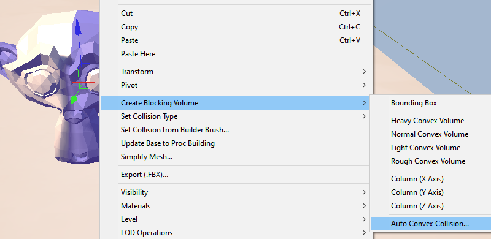
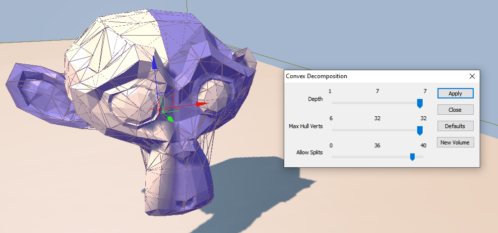

# UDK Basics

## Map Detail

The sky is the limit for what you can add to a map. Please take time to mess with anything that sounds interesting, and maybe you’ll invent a fun new mechanic for the game.

## Cinematic Camera

This is entirely bonus material, but you have complete control over the camera angle shown when loading into a multiplayer game. **Simply add a CameraActor and point it at your map.** It has to be above height 0, but otherwise can be anywhere.

## Volumes

Often times you will want to trigger events when a player enters a certain area. On a Rings-style aerial control training course, maybe you want to teleport the player back to the last checkpoint if they miss a ring. Perhaps you want to change the lighting of the map in some sort of control panel.

Similarly, maybe you want to invert gravity in part of the map, or have invisible walls. There are over 30 types of volumes in UDK, so please experiment with any that sound interesting, but some of the most useful ones will be described here.

* `TriggerVolume` - Run Kismet when the player or ball enters this volume
* `DynamicTriggerVolume` - Same as a TriggerVolume, but this may be moved by Kismet
* `GoalVolume_TA` - If the ball enters this volume, a goal is counted
* `GravityVolume` - Adjust vertical gravity within this space (or invert to give a floating effect)
* `LightmassImportanceVolume` - Require higher fidelity on lightmaps in this region
* `PostProcessVolume` - Adjust colors or apply affects

Keep in mind that these volumes are not allowed to move, unless they have Dynamic at the start.

## RBCC

Rigid Body Collision Channels, also known as Red Bull Cubic Centimeters (not really), are a way to change which types of actors a StaticMeshActor or a BlockingVolume will collide with. In general this should stay set to RBCC_Default, but there are times when you need specific collision types. Some examples of this in-game:

The net in Hoops, which players may drive through but the ball hits
The (revealed) floor in Dropshot, which the ball may pass through but players hit

If the UDK setup process went correctly, there should be three new entries in addition to the 15 already in there:
* RBCC_Ball
* RBCC_BallBlocker
* RBCC_VehicleBlocker

Hopefully the latter two are self-explanatory. RBCC_Ball seems to be nearly identical to the default, but perhaps with greater precision applied to the collision calculations.

To create objects which have these collision properties, open the Properties window of a StaticMeshActor or a BlockingVolume. **Set the same parameters for a normal collision (uncheck Disable All Rigid Body and check Block Rigid Body). Then, search for “rbc” and select one of the RBCC options from above.**

# Custom Volume Shapes

The standard Brush shapes should cover 99.5% of Volume needs, but there is a workaround to get a truly custom Volume shape.

*Unblocking the potential of custom volumes*

:::warning SAVE
First, save your map. UDK likes to crash when doing this process on complex objects.
:::

**Add a `StaticMeshActor` with your desired shape. Right click, select Create Blocking Volume, and then Auto Convex Collision…**

*Unblocking the potential of custom volumes*

After selecting the Auto Convex Collision, a small popup will appear. `Depth` refers to the precision of the shape around the object. `Max Hull Verts` refers to the number of points the collision will have. `Allow Splits` means that the result will actually be made of distinct pieces. This should be no problem for a TriggerVolume (which a player or ball merely needs to touch to interact with), but it will be problematic for a GoalVolume (which has to fully contain the ball to score a goal).

*Trigger warning*

## Particle systems <Badge text="not finished" type="warning"/>