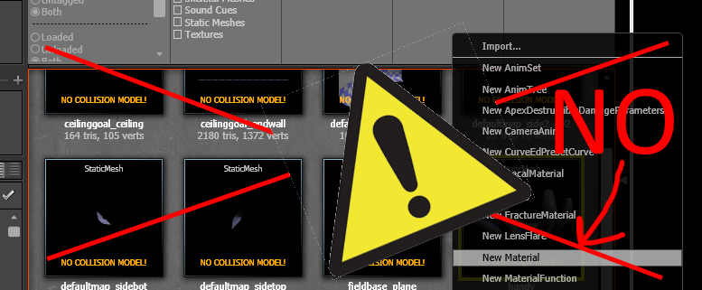
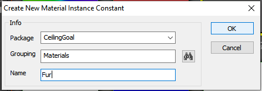
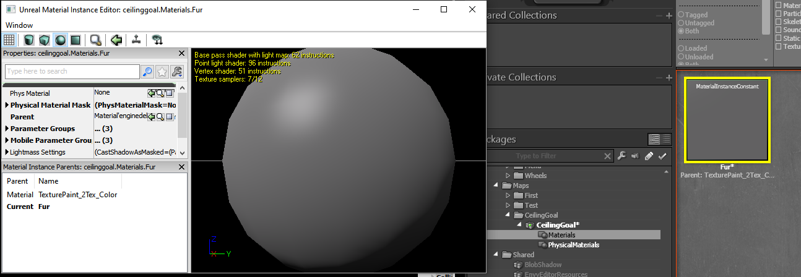
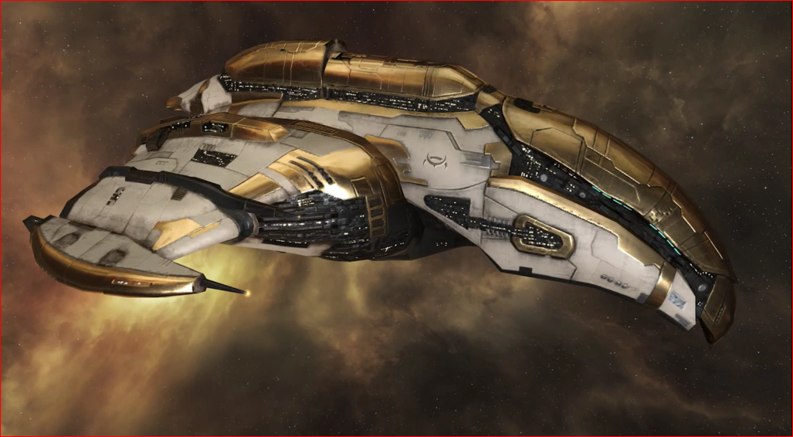
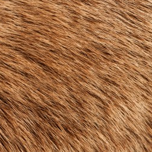

# UDK Advanced 

[Dummy Assets](dummy_assets) are a powerful tool which gives you instant access to hundreds of materials which are ready to go. But, it’s hard to achieve a truly custom look using pre-built stuff. To make an honestly custom map, we need Custom Materials.

## Public Service Announcement

**There is a key limitation to custom materials for Rocket League maps, and it has to do with the same property that allows Dummy Assets to begin with. Rocket League only allows materials which exist within packages already inside `CookedPCConsole`**. Whereas brand new meshes, particle systems, and certain other objects may be created within a new map project, we are not so lucky with materials. In fact, the only reason we are able to have any new materials is thanks to the inclusion of Startup.upk within Rocket League’s files (thanks Psyonix).

*Don’t believe his lies*

**The New Material option will only break your heart.**

Instead, we have to rely on `Material Instances`. As mentioned briefly in a previous section, Material Instances are copies of a base material which allow for customization of certain parameters. This idea is widespread through UDK, Unreal Engine, and programming in general. To use a C++ description, this is equivalent to passing arguments into the constructor of a class.

## Available Base Materials Within Startup.upk
I will kindly refer you to [Derzo’s spreadsheet](https://docs.google.com/spreadsheets/d/1KLs5r_sUn3W6rLrw_xQJbEK-LOmxCiBRfo9_XI79Kng/), which outlines all of the available options.

**For ___ Channel rows, “Texture” means that it will accept an image. “Vector” means it may only be a solid color. Rows in bold (in this table) are the most important:**

|Column Name|What it means|
|------|------|
|Material|The name of the material|
|Package|The package it may be found in. Avoid Red packages if you don’t want to force/require people to put extra .upks into their game.|
|RenderMode|The general lighting property. Lit materials will have shading. Unlit will not be affected by lights. Translucent may be see-through (i.e. have an alpha channel)|
|Diffuse Channel|The color of the material|
|Emissive Channel|The areas which emit light (i.e. unaffected by other lighting)|
|Normal Channel|Bumps and small surface details (also called a normal map)|
|Specular Channel|The areas which will be shiny|
|Opacity Channel|The areas which will be solid or see through (also called an alpha map)|
|TwoSided|Faces with this material can be seen from the anti-normal side|
|MasterOnly|Material instances (customizations) will not work|
|Special|Something that makes this material notable|
|Skeletal|This material can go on a skeletal mesh (like a walking character)|
|Fractured|This material can go on objects which break apart|
|ParticleSprite|This material can go on individual particles|
|BeamTrails|This material can go on effect trails|
|ParticleSubUV|This material can do something extra cool with particles, probably|
|StaticLighting|This material accepts static lighting|
|FluidSurface|This material can go on a fluid surface|
|MaterialEffect|This material can be used as an effect|

As you can hopefully see, rows with more green boxes are better. **Rows with a red box under “Package” should be avoided, otherwise you will need to mention and refer people to the “Workshop Textures” setup on the page for your map.**

This leaves us with a few key options for creating custom materials. All of these may be found within the package `Engine > Content > EngineDebugMaterials`:

|Name|Useful for|
|------|------|
|LevelColorationLitMaterial|Solid colors with shading based on world lighting|
|LevelColorationUnlitMaterial|Solid colors with no shading (i.e. a truly solid color)|
|TerainCollisionMaterial|Solid colors with adjustable transparency|
|**TexturePaint_2Tex_Color**|**Most textured custom materials**|
|VertexPaint_2Tex_Color|Textured custom materials with vertex color|
|VertexPaint_4Tex|Same, but with more texture slots|

The VertexPaint materials are unlikely to be any more useful than TexturePaint_2Tex_Color, but you are welcome to use them. Vertex painting is a way to colorize materials based on which part of the mesh they cover, but its usefulness is complicated when talking about Rocket League mapmaking.

## Creating a TexturePaint_2Tex_Color Material Instance
This material is the chosen one when it comes to custom materials for Rocket League maps. Now to get down to business.

*Yes*

**Find TexturePaint_2Tex_Color at the bottom of Engine>Content>EngineDebugMaterials. Right click it and hit Create New Material Instance (Constant)...**

*Details, details, details...*

**Fill in the information in the popup window, making sure to put this Material Instance into your map project.**

*At long last, we meet again for the first time, for the last time*

An uninspiring gray sphere will show up in a popup window, and the Content Browser will switch packages to highlight the new creation. **Double check that this exists within your map project.**

## Material Channels
A Material Instance, as mentioned, has a number of parameters which may be customized. In the case of a material based on TexturePaint_2Tex_Color, we are able to control the Diffuse channel (color), Emissive channel (brightness of light emitted), Normal channel (surface displacement to add detail), and Spec[ular] channel (shininess), **all with textures.**

In this context, “Channel” simply refers to a property of the material. Red, Green, and Blue are often referred to as the Red channel, Green channel, and Blue channel in image editing software. Consider this render from the game EVE Online:

*UDK = Null sec*

Obviously the ship has color, which is provided by the **Diffuse** channel. The gold panels are much shinier than the off-white hull, which is made possible with the **Specular** channel. Small lights are visible around the inhabited parts of the ship thanks to the **Emissive** channel. And, all of the intricate detail surrounding those windows is probably not mesh geometry, but rather comes from the **Normal** map. An additional channel which is handled internal to Unreal Engine is the **Lightmap**, which provides subtle shadows (often called Ambient Occlusion or AO) where different parts of the ship meet.

Not every material in the game will need to have this much detail (obviously), but when used properly these material channels can make a mesh look amazing. What we are about to make will not look amazing, but it will open the door to whatever you want to make.

## Applying Textures to Material Instance Channels

*Fur Elise*

I will be using this stupid fur texture that I stole from the internet. You are welcome to copy it from here, or work with any other texture you like. 
:::tip GIVE CREDITS
**Many websites want to charge you to use their images and textures. Often these are higher quality, but there are enough free resources available that you should have all you need. Give credit where credit is due if you use something which obviously had a lot of work put into it.**
:::

**Textures must be .TGA (Targa) files, with a resolution that is a power of 2. I will be importing this as 256x256, which is rather low-quality.** See the table above for some guidance on texture resolutions.

*Import-ant screenshot*

**Import the texture by dragging it from your File Browser into the Content Browser.** I prefer to keep textures in a Texture grouping to reduce clutter, but this is not required.

**Double click the Material Instance you created to bring up the Material Instance Editor window (or keep it open after creating the Material Instance).** I prefer to make the left panel much bigger and the right preview much smaller.

*It’s happening fur real now*

**Select the imported texture in the Content Browser. Find the Diffuse channel under Parameter Groups > Texture Parameter Values. Click the green arrow to assign the texture to this channel. Lastly, click the checkbox next to the word Diffuse. The preview will update when you do this step, which indicates that this succeeded.**

**Apply this to a mesh and check it out in the game!** In the [Textures guide](../textures) there is a detailed explanation of the other channels and how to create textures for them. Diffuse will achieve 90% of the look you are going for, and is the easiest and most intuitive. **Generally speaking, you can make a perfectly acceptable map with custom materials that only use the Diffuse channel.**

Once Emissive, Specular, and Normal maps have been created, they may be applied in exactly the same way. Textures may also be updated following the exact same process as meshes.