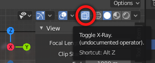

# Blender Basics

You can make anything in Blender, given enough patience and time. This guide is both impatient and rushed, so we will get straight to cranking out map assets.

Let’s start with easy assets for a skate park. We’ll make a box ramp, a halfpipe, a rail, and a loop

*These are healthy X-Rays*

## Model meshes

**Enter Edit mode, and click the Toggle X-Ray button in the top right of the 3D Viewport.** This will allow you to select geometry which is “behind” other geometry. Occasionally it is helpful to turn this off, but try to always be aware of which mode you’re operating in.

:::details Simple mesh - Box Ramp

:::
:::details Simple mesh - Halfpipe

:::
:::details Simple mesh - Loop

:::
:::details Advanced Mesh - Wacky Skatepark Bowls

:::
:::details Advanced Mesh - Human Hand

:::

## Key Takeaways <Badge text="important" type="tip"/>

- Hotkeys are your best friends
- Start with a base mesh that makes your life easier
- Ring select (Alt+click), Box select (B), and Circle select (C) are wonderful
- Make the most of the 3D cursor
- Bevel (Ctrl+B) is a great tool for making rounded edges
- Proportional Editing (O) is great for making strange, curved surfaces
- Subdivision Surface Modifiers can help you smooth everything
- Always use Angle-Based Smoothing
- Use modifiers like Mirror or Array to minimize the amount of work you have do while also doing it better
- Use reference images and sketches when possible
- Matcaps are a great way to view your meshes

Have fun! Blender is great!